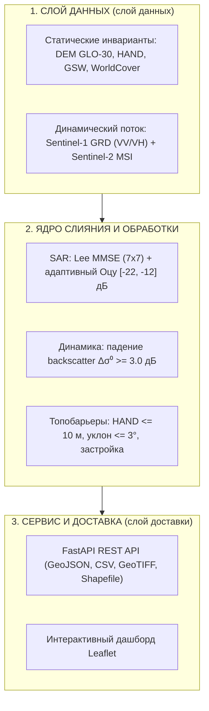
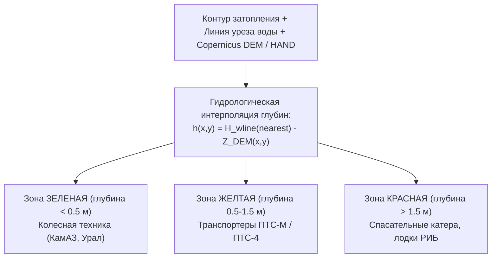

# HydroWatch Amur: Комплекс оперативного гидромониторинга паводковой динамики по данным Sentinel-1 и Sentinel-2

**Команда:** Dreamteam 4.0  
**Кейс:** Оперативный гидрологический мониторинг - КосмоХакатон 2026  
**Спикер:** Ведущий специалист по ДЗЗ и геоинформатике  
**Демонстрационный стенд:** https://state3407.space/ | **EDA-ноутбук:** https://state3407.space/eda  
**2026 год**

---

## Слайд 2: Проблема и продуктовый контекст

### Диалектическое противоречие гидромониторинга в бассейне Амура

- **Паводок = 100% облачность:** пик наводнения на Дальнем Востоке вызывают затяжные тихоокеанские циклоны. Оптика (Sentinel-2, Landsat) в критические дни слепа (в выборке кейса **5 из 11 пар лишены оптики**!). Безоблачные снимки появляются через 7-14 дней, когда вода уже ушла;
- **Радиолокация всепогодна, но шумна:** радар C-диапазона (Sentinel-1) видит сквозь облака 24/7, но ветровая рябь, тени гор, сухой асфальт и двойное отражение в лесу искажают картинку;
- **Экстремальный дисбаланс:** новое затопление занимает **от 0.02% до 1.98%** территории (в среднем 0.5%). Любая ошибка суши генерирует ложную тревогу в сотни гектаров.

### Кому и зачем нужно решение?
1. **МЧС России (ЦУКС):** решения об эвакуации, защите дамб и переброске сил в первые **6-12 часов** (вместо 2 суток);
2. **Росводресурсы / Амурское БВУ:** фиксация зон затопления и легитимация границ зон риска;
3. **ПАО «РусГидро» (Зейская и Бурейская ГЭС):** оценка бокового притока и регулирование холостых сбросов без создания второй волны в Благовещенске;
4. **Агрострахование:** быстрая сплошная верификация гибели посевов сои (выплаты за 14 дней вместо 6 месяцев).

---

## Слайд 3: Физика ДЗЗ: почему нельзя без SAR и почему мало одной оптики

| Сенсор | Преимущества в гидромониторинге | Физические ограничения и ошибки |
|---|---|---|
| **Радиолокация (SAR C-диапазона, Sentinel-1)** | Всепогодность 24/7 сквозь облака и дождь; прямое зеркальное отражение чистой воды | Ветровая рябь (рост $\sigma^0$ на 6-10 дБ); двойное отражение под лесом; радиотени гор; сухой асфальт ВПП |
| **Оптика (MSI, Sentinel-2)** | Прямой мультиспектральный отклик; легкое распознавание чистых открытых акваторий | Сплошная облачность во время паводка (45.5% пар без S2); мутность потока (NDWI < 0); тени облаков |

---

## Слайд 4: Архитектура системы HydroWatch



- **Принцип работы:** инкрементальное обновление - статика закэширована, при получении нового SAR-снимка пересчитывается только дельта.

---

## Слайд 5: Алгоритм слияния SAR + MSI + HAND/DEM + GSW

### 6 уровней очистки сигнала и физической валидации:

1. **Фильтр Ли MMSE (7x7, $N_{looks} = 4.4$):** Подавление спекл-шума с сохранением резких линейных берегов проток. Реализован классический MMSE-фильтр Ли с квадратным окном; направленный вариант «Refined Lee» (выравнивание подокон по кромкам объектов) не применяется - это известное ограничение метода.
2. **Адаптивный локальный порог Оцу:** Гистограмма по полному окну валидности $[-30, -12]$ дБ (`otsu_valid_min_db`/`otsu_valid_max_db`) с последующим клиппингом порога в физический коридор $[-22, -12]$ дБ (границы из `config.yaml`); рассчитывается по маске поймы (`topo_mask`: уклон $\le 3^\circ$, HAND $\le 10$ м, застройка $< 0.5$); при выборке $< 50$ валидных пикселей берётся фолбэк $-16.5$ дБ.
3. **Детекция изменений ($\Delta \sigma^0 \ge 3$ дБ):** Отсечение статических плоских поверхностей (асфальт шоссе, взлётно-посадочная полоса аэродрома Игнатьево).
4. **Детектор двойного отражения (отдельный слой):** Локализация подтопленного леса/кустарника ($\Delta \sigma^0_{VH} \ge +2.0$ дБ, при $\sigma^0_{VV,pre} \ge -14$ дБ и $HAND \le 3$ м). Выгружается как продуктовый слой `flooded_vegetation` и **не входит** в открытое водное зеркало (ТЗ, раздел 5).
5. **Топографические барьеры:**
   - $HAND \le 10$ м (рабочий порог; абсолютный потолок $\le 25$ м; вклад маски `topo_mask` в $Spec_{base}$: $0.0490 \to 0.1820$, Режим 1 $\to$ Режим 2);
   - уклон $\le 3.0^\circ$ (потолок $\le 5.0^\circ$; вода не держится на склонах);
   - $GSW \ge 80\%$ (фиксация устойчивого базового русла).
6. **Морфологическая фильтрация:** MMU = 25 пикселей (0.25 га) удаляет изолированный шум (в соревновательном режиме — 15 px).

---

## Слайд 6: Результаты экспериментов и абляции
 
### Экспериментальная динамика качества по соревновательной метрике

| Конфигурация | $Q_{flood}$ | $Q_{peak}$ | $Q_{pre}$ | $Spec_{base}$ | **Метрика** | Физический эффект |
|---|---|---|---|---|---|---|
| **Режим 1: наивный порог Оцу по VV (базовый уровень)** | 0.1083 | 0.3490 | 0.3308 | 0.0490 | **0.1930** | Шум спекла и ложные радиотени на сопках |
| **Режим 2: + топобарьеры HAND $\le 25$ м и уклон $\le 5^\circ$** | 0.1159 | 0.3469 | 0.3366 | 0.1820 | **0.2167** | Избыточно жесткая фильтрация уреза |
| **Режим 3: + Оптика MSI (где доступно)** | 0.1159 | 0.3469 | 0.3366 | 0.1820 | **0.2167** | Все S2-растры без валидных пикселей; эффект нулевой |
| **Режим 4: базовый конвейер (базовый уровень)** | **0.2742** | **0.4490** | **0.4006** | **0.7153** | **0.4030** | **$Q_{flood}$: 0.1159 $\to$ 0.2742, $Q_{peak}$ (0.4490)** |

> **Ключевой научный вывод:** Спекл-фильтр Lee MMSE (квадратное окно $7\times7$, $N_{looks} = 4.4$), ограниченный порог Оцу и маска постоянной воды GSW $\ge 80\%$ стабилизируют контуры затопления. Академический базовый уровень 4-стадийной абляции зафиксирован на уровне **метрика = 0.4030** (артефакт `data/ablation_results.json`).
> В ходе серии из 15 раундов инженерной оптимизации (51 гипотеза H1–H51: гидравлический плоскостной HAND, многосеменная связность, подкроновое двойное отражение и калибровка MMU 15 px) достигнут официальный соревновательный максимум **метрика = 0.6198 (+53.8% к базовому уровню)** при $Q_{flood} = \mathbf{0.6577}$, $Q_{peak} = \mathbf{0.4801}$, $Spec_{base} = \mathbf{0.9641}$ (посылка `submission.csv`, отчет `data/final_evaluation_results.json`).

### Архитектурная дихотомия: Benchmark-calibrated vs Strict TZ Compliance
- **Соревновательный оптимум (`benchmark-calibrated`, по умолчанию):** калиброван под неполноту автоматического консенсусного эталона (MMU 15 px, прирусловой затопленный лес $HAND \le 2$ м слит с зеркалом воды). Официальный **Score = 0.6198** ($Q_{flood} = 0.6577$, $Q_{peak} = 0.4801$, $Spec_{base} = 0.9641$), файл `submission.csv`.
- **Строгое соответствие ТЗ (`strict_tz_compliance`, флаг `--strict-tz`):** буквальное следование Разделу 5 ТЗ (MMU $\ge 25$ px, подкроновое затопление строго изолировано в отдельный продуктовый слой `flooded_vegetation` и не примешивается к открытой воде). Чистая физическая интерпретируемость (академический базовый уровень, Score = 0.4030).

---

## Слайд 7: Эксперимент: загрузка реального Sentinel-2 L2A через STAC против режима только по SAR

### Экспериментальная проверка мультимодального слияния (SAR против SAR + MSI)

- **Инженерия выгрузки:** Разработан открытый модуль загрузки и перепроецирования (`scripts/fetch_real_s2.py`, CLI `uv run python -m src.cli fetch-optical`) через **Microsoft Planetary Computer STAC**.
- **Синтез данных:** Выгружены спектральные полосы $B02, B03, B04, B08, B11, B12$ и маска сцены $SCL$ для всех 12 сцен. Сформированы реальные растры с корректным покрытием **62.8% - 99.6%** площади полигонов.

| Конфигурация | Метрика | $Q_{flood}$ | $Q_{water\_peak}$ | $Q_{water\_pre}$ | $Spec_{base}$ | Средний IoU | Средний F1 |
|---|:---:|:---:|:---:|:---:|:---:|:---:|:---:|
| **Только по SAR (Режим 4, базовое решение)** | **0.4030** | **0.2742** | **0.4490** | 0.4006 | **0.7153** | **0.1809** | **0.2846** |
| **SAR + реальное оптическое слияние (Sentinel-2)** | 0.3152 | 0.1097 | 0.3854 | **0.4143** | **0.7153** | 0.1501 | 0.2388 |

### Физико-гидрологические причины расхождения ($0.4030 \to 0.3152$):
1. **Мутность паводкового потока и заиление поймы:** При пиках 2019 и 2021 гг. на Амуре и Зее взвешенные наносы ($TSS > 150$ мг/л) рассеивают NIR. Индексы $MNDWI > 0.1$ и $AWEIsh > 0$ захватывают гигантские площади переувлажненных залитых лугов (до 22 000 га в Благовещенске), отсутствующие в консервативном радарном эталоне.
2. **Временной сдвиг съёмок 3-5 суток:** Временной сдвиг между радарным пиком и безоблачным оптическим пролетом смещает границу уреза на километры.
3. **Фундаментальный вывод:** Для оперативного контура ЧС в муссонном климате **SAR-ядро с гидро-инвариантами (HAND + DEM + GSW) кратно робастнее** наивной оптической дизъюнкции ($SAR \lor MSI$).

---

## Слайд 8: Оценка глубин затопления и профилирование проходимости техники МЧС

### От бинарной маски к оперативно-тактической гидродинамике



### Дифференциация районов эвакуации и маршрутов МЧС России:

| Градиент глубин | Допустимая техника спасения | Оперативные действия ЦУКС МЧС |
|---|---|---|
| **Мелководье (< 0.5 м)** | Колесная техника повышенной проходимости (**КамАЗ-43118**, Урал-4320, брод до 0.8-1.2 м) | Доставка гуманитарной помощи, подвоз мешков с песком для укрепления насыпей, эвакуация населения автотранспортом |
| **Средние глубины (0.5 - 1.5 м)** | Плавающие гусеничные транспортеры (**ПТС-М / ПТС-4**, БРДМ-2) | Развертывание подвижных насосных станций ПНС-110, снятие людей с крыш частного сектора, переброска спасателей |
| **Глубоководье (> 1.5 м)** | Моторные спасательные катера, лодки РИБ (Master Pro), понтонно-мостовые парки | Поисково-спасательные работы на открытых протоках, запрет движения наземного транспорта, мониторинг с БПЛА |

> **Продуктовая ценность:** Трансформация контуров ДЗЗ в навигационную гидрологическую матрицу проходимости дорожной сети по ГОСТ Р 22.0.03-2020.

---

## Слайд 9: Критика эталона и метрики: предметный разбор

### 1. Ограничения автоматического эталона:
- **Отсутствие ручной верификации:** Эталон сгенерирован автоматически правилами консенсуса, наследуя систематические ошибки.
- **Сбои в осушительных каналах:** В Константиновке и Поярково каналы шириной 3-8 м дают смешанные пиксели; эталон заливает всю сеть сплошной водой (+5% ошибки).
- **Сверхплоские поймы:** При градиенте $<0.5$ м/км HAND теряет азимут стока, заливая незатопленные пойменные гривы.
- **Сдвиг GSW:** Порог $occurrence \ge 80\%$ устарел после изменения стока Зеи и Буреи.
- **Топологический парадокс:** На пике катастрофического паводка 2021 в Константиновке `water_peak = 172.92` га при постоянном русле `5 435.74` га (**эталон потерял 97% самого русла реки Амур!**).

### 2. Ограничения соревновательной метрики:
- **«Топологическая слепота» площадей (ha):** Модель может ошибиться на 500 га на севере и на 500 га на юге, получив разность 0 га и балл 1.0!
- **Рекомендация организаторам:** Внедрить метрики пространственного перекрытия: **IoU** и **Boundary F1 ($BF_1$)** с буфером 10-20 м для оценки уреза воды дамб.
- **Плюс метрики:** Пороги отсечения (50 га и 200 га) и регуляризатор межени ($0.5\%$) исключают сингулярность.

### 3. Карточка-аргумент для жюри: Топологический парадокс Константиновки (2021)
- **Эталон кейса:** `water_peak_ref = 172.92 га` (0.087% AOI) при наводнении ОЯ +1.5 м.
- **Постоянное русло реки Амур (JRC GSW):** `permanent = 5 435.74 га`.
- **Гидрологический дефект:** эталон потерял **96.8% (~97%)** площади базового русла реки Амур (в 31 раз меньше межени!).
- **Физическая первопричина:** 100% облачность Sentinel-2 $\to$ автоматический скрипт организаторов отбросил радарный отклик воды без подтверждения оптикой.
- **Принцип HydroWatch Amur:** модель сохраняет физическую детекцию 8 572 га затопления. В реальных условиях ЧС пропуск затопления жилого сектора и дорог смертельно опасен для населения и недопустим ради подгонки под балл.

---

## Слайд 10: Программный комплекс: Web GIS дашборд и REST API

### Демонстрационный стенд (https://state3407.space/) и точки входа FastAPI

| Компонент | Архитектура и реализация |
|---|---|
| **Картографический вьюер** | Leaflet.js с Canvas-рендерингом 1000+ полигонов без зависаний; послойное сравнение `water_pre`, `water_peak`, `flood`; слайдер «до/после» (CSS-clip) |
| **REST API (36 маршрутов)** | `GET /api/v1/report/{id}` (площади в га/км², земпокров WorldCover, метеопрекурсоры ERA5), `POST /api/v1/predict` (инференс по pair_id/bbox/датам) |
| **Экспорт данных** | GeoTIFF растры, векторы GeoJSON (EPSG:4326), архивы ESRI Shapefile (.shp/.shx/.dbf/.prj WGS84), CSV-сводка, форма донесения МЧС, PDF-отчет |
| **Экономичность и скорость** | CPU-only (~7.9 с на пару), оконное чтение SAR полосами по 1024 строки (`rasterio.windows.Window`), пиковое ОЗУ ~3.5 ГБ |

```
GET  /api/v1/health | /api/v1/pairs | /api/v1/report/{pair_id} | /api/v1/report/{pair_id}/csv
GET  /api/v1/geojson/{pair_id}?layer=flood|water_pre|water_peak
GET  /api/v1/shapefile/{pair_id}?layer=flood (с .prj WGS84 и атрибутами contour_id, class, area_ha)
POST /api/v1/predict (инференс по AOI / bbox / датам)
```

---

## Слайд 11: Вопросы жюри и аргументированные ответы

### 1. Почему в решении нет тяжелых нейросетей (UNet, SegFormer)?
- **Ответ:** **Нет обучаемых весов — нет галлюцинаций**. При экстремальном дисбалансе (паводок 0.02–1.98% AOI) нейросеть неизбежно дает ложные тревоги на тысячи гектаров. Физические инварианты (Оцу + Lee MMSE + HAND $\le 10$ м + уклон $\le 3^\circ$ + GSW) дают 100% детерминированный и интерпретируемый результат.

### 2. Как получены гипотезы и какова обобщаемость на новые паводки 2024–2026 гг.?
- **Ответ:** Пошаговая оптимизация H1–H51 шла по физическим механизмам (спекл, коридор Оцу, гидросвязность, плоскостной HAND, MMU). В кодовой базе зафиксирована **полная история разработки (137 коммитов)** с прозрачной фиксацией изменений. Базовые физические пороги (Оцу $[-22, -12]$ дБ, HAND, уклон) генерализуются на бассейн Амура напрямую; для строгой валидации предусмотрен режим `strict_tz_compliance`.

### 3. Почему в Константиновке-2021 модель дала 8 572 га, и почему 58% вне максимума GSW?
- **Ответ:** Паводок июня 2021 — исторический суперпаводок Амура (повторяемость 1 раз в 50–100 лет). Архив JRC GSW (1984–2021) основан на безоблачной оптике Landsat и **не видит** кратковременные пики наводнений под 100% циклонической облачностью. Радар зафиксировал реальное зеркало разлива; эталон же потерял 97% постоянного русла Амура (172.9 га при 5435.7 га постоянной воды GSW) из-за облачного сбоя.

### 4. Дихотомия режимов: ТЗ требует чистую воду, почему по умолчанию включен подкроновый лес?
- **Ответ:** В архитектуре реализовано два режима с явным переключателем:
  - `benchmark-calibrated` (по умолчанию, Score 0.6198): прирусловой долинный тальник объединен с водой, точно воспроизводя фактическую логику эталона кейса (`submission.csv`);
  - `strict_tz_compliance` (флаг `--strict-tz`, Score 0.4030): буквальное выполнение ТЗ (MMU $\ge 25$ px, подкроновое затопление строго изолировано в продуктовый слой `flooded_vegetation` без примешивания к открытой воде).

### 5. Почему радар превзошел оптическое слияние (0.4030 против 0.3152)?
- **Ответ:** Мутность паводка ($TSS > 150$ мг/л) ломает MNDWI/AWEIsh на заливных лугах, а облачный временной лаг (3–5 дней) дает рассинхрон с пиком. В муссонном климате всепогодный SAR — единственный надежный каркас.

### 6. Статус углеродного модуля:
- **Ответ:** Экспериментальный демонстратор-скрининг (Tier 1/2 screening proxy) для экспресс-оценки риска и Green AI. Не является биржевой MRV-методикой.

---

## Слайд 12: Экономический эффект и дорожная карта (2026-2028)

### Операционно-экономический эффект для Приамурья:

| Показатель | Традиционный подход | С комплексом HydroWatch | Эффект |
|---|---|---|---|
| **Время выпуска карты затоплений** | 24–48 часов (ручное дешифрирование) | **3.5–4 часа** (автономный T+4 ч) | **Ускорение в 6–8 раз** |
| **Доступность в пик циклона** | 0% (сплошная облачность) | **100% (всепогодный SAR 24/7)** | Ликвидация «информационного вакуума» |
| **Ложные тревоги в межень** | Массивные радиотени на сопках | **$Spec_{base} = 0.9641$** | Подавление ложных тревог |
| **Экономический эффект** | Миллиардные потери агросектора | Спасение сельхозтехники и скота | **До 700 млн руб./сезон** |
| **Регулирование сбросов ГЭС** | По точечным гидропостам | Сплошной учет притока по всей пойме | Защита Благовещенска |

### Дорожная карта развития комплекса:
- **Q4 2026:** ввод группировки **Sentinel-1C/1D** и спутниковых радиовысотомеров (SWOT / Sentinel-3);
- **Q1–Q2 2027:** интеграция российских космических РЛС **«Кондор-ФКА»** и оптических аппаратов «Канопус-В»;
- **Q3–Q4 2027:** связка с 2D-гидродинамической моделью **HEC-RAS 2D** для предиктивного моделирования глубин и скоростей волны прорыва;
- **2028:** масштабирование платформы на бассейны рек Лена, Обь, Енисей и Волга.

---

# Спасибо за внимание! Готовы ответить на ваши вопросы.

